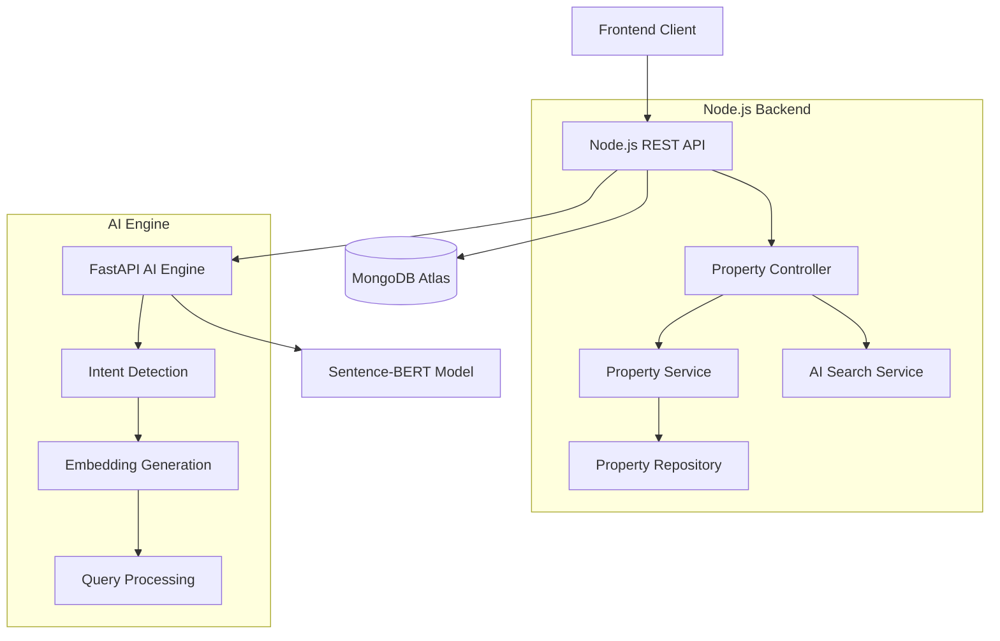

# Design Document

## Overview

The AI-powered property search backend is a microservices architecture consisting of a Node.js REST API server, MongoDB database, and a separate FastAPI-based AI engine. The system processes natural language queries through AI intent detection, performs semantic and geospatial searches, and returns ranked property results.

## Architecture

### High-Level Architecture



### Service Architecture

The system follows a layered architecture pattern:

1. **API Layer**: Express.js routes and middleware
2. **Controller Layer**: Request/response handling and validation
3. **Service Layer**: Business logic and orchestration
4. **Repository Layer**: Data access and MongoDB operations
5. **AI Integration Layer**: Communication with FastAPI service

## Components and Interfaces

### 1. Node.js REST API Server

**Technology Stack:**
- Runtime: Node.js with Express.js
- Validation: Joi for input validation
- Authentication: JWT (future implementation)
- Documentation: Swagger/OpenAPI 3.0

**Key Components:**

#### Property Controller (`/controllers/propertyController.js`)
```javascript
// Handles HTTP requests and responses
class PropertyController {
  async createProperty(req, res)
  async getProperty(req, res)
  async updateProperty(req, res)
  async deleteProperty(req, res)
  async searchProperties(req, res)
  async getSimilarProperties(req, res)
}
```

#### Property Service (`/services/propertyService.js`)
```javascript
// Business logic and orchestration
class PropertyService {
  async createProperty(propertyData)
  async searchWithAI(query, filters)
  async calculateSimilarity(propertyId, targetEmbedding)
  async rankResults(properties, relevanceScores)
}
```

#### AI Search Service (`/services/aiSearchService.js`)
```javascript
// Integration with FastAPI AI engine
class AISearchService {
  async processIntent(naturalLanguageQuery)
  async generateEmbedding(text)
  async extractSearchParameters(intentResponse)
}
```

### 2. MongoDB Database Schema

#### Property Schema
```javascript
const propertySchema = {
  title: { type: String, required: true, text: true },
  description: { type: String, required: true, text: true },
  price: { type: Number, required: true, min: 0 },
  propertyType: { 
    type: String, 
    enum: ['house', 'condo', 'townhouse', 'land'], 
    required: true 
  },
  area: { type: Number, required: true, min: 0 }, // square meters
  rooms: {
    bedrooms: { type: Number, min: 0 },
    bathrooms: { type: Number, min: 0 }
  },
  location: {
    type: { type: String, enum: ['Point'], required: true },
    coordinates: { type: [Number], required: true }, // [longitude, latitude]
    address: { type: String, required: true },
    district: String,
    province: String
  },
  features: [String], // amenities, nearby facilities
  embedding: [Number], // semantic embedding vector
  createdAt: { type: Date, default: Date.now },
  updatedAt: { type: Date, default: Date.now }
}

// Indexes
propertySchema.index({ location: '2dsphere' }); // Geospatial index
propertySchema.index({ title: 'text', description: 'text' }); // Text search
propertySchema.index({ price: 1, propertyType: 1 }); // Filtering
propertySchema.index({ 'location.coordinates': '2dsphere' }); // Geo queries
```

### 3. FastAPI AI Engine

**Technology Stack:**
- Framework: FastAPI with Uvicorn
- ML Model: Sentence-BERT (all-MiniLM-L6-v2)
- Libraries: sentence-transformers, numpy, pydantic

**Components:**

#### Intent Detection Service (`/ai_server/services/intent_service.py`)
```python
class IntentService:
    def __init__(self):
        self.model = SentenceTransformer('all-MiniLM-L6-v2')
        
    async def process_query(self, query: str) -> IntentResponse:
        # Extract keywords, price ranges, location hints
        # Generate semantic embedding
        # Return structured intent data
```

#### API Endpoints (`/ai_server/main.py`)
```python
@app.post("/intent")
async def detect_intent(request: QueryRequest) -> IntentResponse

@app.post("/embedding")
async def generate_embedding(request: TextRequest) -> EmbeddingResponse

@app.post("/similarity")
async def calculate_similarity(request: SimilarityRequest) -> SimilarityResponse
```

## Data Models

### API Request/Response Models

#### Search Request
```javascript
{
  "query": "บ้านใกล้โรงเรียน งบไม่เกิน 2 ล้าน",
  "filters": {
    "priceRange": { "min": 0, "max": 2000000 },
    "location": { "lat": 13.7563, "lng": 100.5018, "radius": 10 },
    "propertyType": ["house", "townhouse"],
    "minArea": 100
  },
  "pagination": { "page": 1, "limit": 20 },
  "sortBy": "relevance" // or "price", "area", "distance"
}
```

#### Search Response
```javascript
{
  "success": true,
  "data": {
    "properties": [
      {
        "id": "property_id",
        "title": "Modern House Near School",
        "description": "3-bedroom house...",
        "price": 1800000,
        "location": {
          "coordinates": [100.5018, 13.7563],
          "address": "123 Sukhumvit Road",
          "distance": 2.5 // km from search center
        },
        "relevanceScore": 0.89,
        "semanticScore": 0.85,
        "locationScore": 0.93
      }
    ],
    "pagination": {
      "currentPage": 1,
      "totalPages": 5,
      "totalResults": 87,
      "hasNext": true
    },
    "searchMeta": {
      "aiProcessingTime": 1.2,
      "dbQueryTime": 0.8,
      "extractedIntent": "Find affordable house near educational facilities"
    }
  }
}
```

### AI Engine Models

#### Intent Response
```python
class IntentResponse(BaseModel):
    keywords: List[str]
    extracted_filters: Dict[str, Any]
    embedding: List[float]
    confidence_score: float
    processing_time: float
    intent_summary: str
```

## Error Handling

### Error Response Format
```javascript
{
  "success": false,
  "error": {
    "code": "VALIDATION_ERROR",
    "message": "Invalid search parameters",
    "details": {
      "field": "priceRange.min",
      "reason": "Must be a positive number"
    },
    "timestamp": "2025-01-15T10:30:00Z",
    "requestId": "req_123456"
  }
}
```

### Error Categories
1. **Validation Errors** (400): Invalid input parameters
2. **AI Service Errors** (503): FastAPI unavailable or timeout
3. **Database Errors** (500): MongoDB connection or query issues
4. **Rate Limiting** (429): Too many requests
5. **Not Found** (404): Property or resource not found

### Fallback Mechanisms
- **AI Service Unavailable**: Fall back to keyword-based text search
- **Embedding Generation Failed**: Use text search with extracted keywords
- **Database Timeout**: Return cached results if available

## Testing Strategy

### Unit Testing
- **Controllers**: Mock services, test request/response handling
- **Services**: Test business logic with mocked dependencies
- **Repositories**: Test MongoDB operations with test database
- **AI Integration**: Mock FastAPI responses, test error handling

### Integration Testing
- **API Endpoints**: Test complete request flow with test database
- **AI Engine**: Test actual FastAPI integration with sample queries
- **Database Operations**: Test with MongoDB test instance

### Performance Testing
- **Search Performance**: Measure response times under load
- **AI Processing**: Benchmark embedding generation speed
- **Database Queries**: Test with large datasets (10k+ properties)

### Test Data
```javascript
// Sample test properties
const testProperties = [
  {
    title: "Modern Condo Near BTS",
    description: "Luxury 2-bedroom condo with city view",
    price: 3500000,
    location: { coordinates: [100.5412, 13.7563] },
    // ... other fields
  }
  // ... more test data
];
```

### Testing Tools
- **Unit Tests**: Jest with Supertest for API testing
- **Mocking**: Sinon.js for service mocking
- **Database**: MongoDB Memory Server for isolated testing
- **Load Testing**: Artillery.js for performance testing

## Performance Considerations

### Database Optimization
- **Indexing Strategy**: Compound indexes for common query patterns
- **Aggregation Pipelines**: Efficient data processing for complex searches
- **Connection Pooling**: Optimize MongoDB connection management

### AI Engine Optimization
- **Model Caching**: Keep Sentence-BERT model in memory
- **Batch Processing**: Process multiple embeddings together
- **Response Caching**: Cache embeddings for common queries

### API Performance
- **Response Compression**: Gzip compression for large responses
- **Pagination**: Limit result sets to prevent memory issues
- **Caching**: Redis for frequently accessed data (future enhancement)

### Monitoring and Logging
- **Request Logging**: Track API usage and performance metrics
- **Error Tracking**: Comprehensive error logging with context
- **Performance Metrics**: Response times, AI processing duration
- **Health Checks**: Monitor service availability and database connectivity